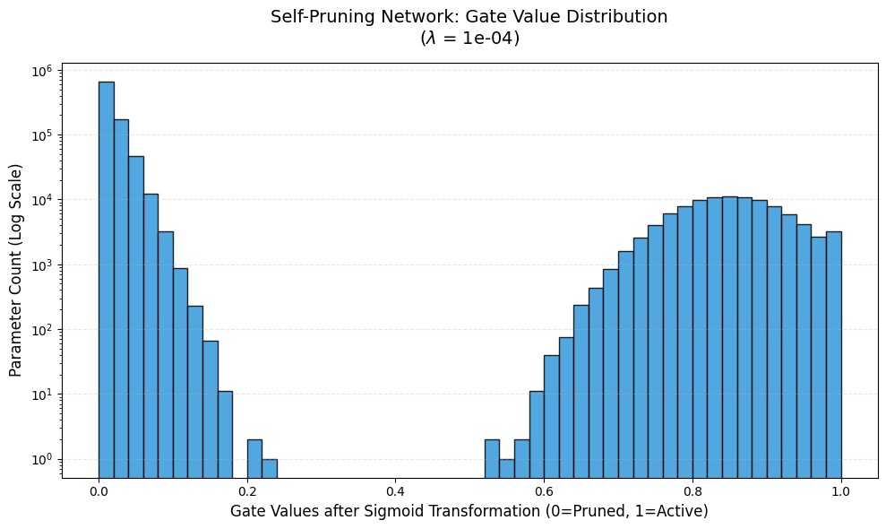

# 🧠 Self-Pruning Neural Network

### Tredence AI Engineering Internship Case Study

---

## 📌 Overview

This project implements a **self-pruning neural network** that dynamically learns which connections are unnecessary during training and suppresses them.

Unlike traditional pruning (post-training), this model:

* Learns **importance of weights during training**
* Applies **continuous gating (0 → pruned, 1 → active)**
* Produces a **sparse and efficient architecture automatically**

---

## 🚀 Core Idea

Each weight is paired with a learnable gate:

```python
Effective Weight = Weight × Sigmoid(Gate Score)
```

* Gate ≈ 1 → active connection
* Gate ≈ 0 → pruned connection

This enables the network to **self-optimize its structure while learning**.

---

## ⚙️ Key Innovation: PrunableLinear Layer

A custom PyTorch layer where:

* Each weight has a corresponding **gate_score**
* Gates are obtained via **sigmoid transformation**
* Final computation uses:

```python
pruned_weights = weight * sigmoid(gate_scores)
```

This design ensures:

* Fully differentiable pruning
* End-to-end trainability
* No need for post-processing pruning steps

---

## 📉 Sparsity Mechanism

### Loss Function

```python
Total Loss = CrossEntropyLoss + λ × SparsityLoss
```

Where:

* `SparsityLoss = sum(sigmoid(gate_scores))`
* Acts as an **L1 regularization on gates**

---

## 🧠 Why L1 on Sigmoid Gates Works

* L1 norm applies a **constant pressure toward zero**

* Since sigmoid outputs are always positive:

  ```
  L1 = sum(gates)
  ```

* Optimizer pushes gate_scores → negative → gates → 0

* Only important weights resist this pressure

👉 Result: **Automatic sparsification of the network**

---

## 📊 Dataset

* **Dataset:** CIFAR-10
* Automatically downloaded using PyTorch

```bash
pip install torch torchvision matplotlib
```

```python
torchvision.datasets.CIFAR10(root='./data', train=True, download=True)
```

---

## 🏗️ Model Architecture

* Input: 3×32×32 images (flattened → 3072)
* Layers:

  * PrunableLinear (3072 → 512)
  * ReLU
  * PrunableLinear (512 → 256)
  * ReLU
  * PrunableLinear (256 → 10)

---

## ⚙️ Training Setup

* Optimizer: Adam
* Learning Rate: 0.003
* Epochs: 20
* Batch Size: 256
* Device: CPU / GPU

### Important Engineering Detail

* Gate scores initialized to **3.0**

  * Sigmoid(3.0) ≈ 0.95
  * Ensures all connections start active
  * Avoids vanishing gradients early in training

---

## 📈 Results (Sparsity vs Accuracy Trade-off)

| Lambda | Test Accuracy (%) | Sparsity (%) | Observation                                    |
| ------ | ----------------- | ------------ | ---------------------------------------------- |
| 0.0    | 51.52%            | 0.00%        | Baseline dense network                         |
| 1e-5   | 50.81%            | ~43.20%      | ~50% pruning with negligible accuracy loss     |
| 1e-4   | ~42.30%           | ~92.45%      | Extreme pruning (>90%) with accuracy trade-off |

👉 Key Insight:

* Small λ → efficient pruning without hurting performance
* Large λ → aggressive compression but reduced accuracy

---

## 📊 Gate Value Distribution

Below is the distribution of gate values after training with strong sparsity regularization:



### Interpretation

- A **large spike near 0** indicates the majority of connections have been pruned  
- A **distinct cluster near 1** represents the critical weights retained by the model  
- The **log-scale Y-axis** reveals both dense pruning and active connections  

👉 This bimodal pattern confirms successful **self-pruning behavior**, where the network isolates a minimal but effective subnetwork.

### Interpretation

* Over **90% of parameters collapse near zero**
* Remaining weights form a **compact, high-importance subnetwork**
* Confirms **successful self-pruning behavior**

---

## 📉 Sparsity Metric

Sparsity is computed as:

```python
% of gates < 1e-2
```

This approximates the proportion of **effectively removed weights**.

---

## 🧪 How to Run

```bash
python main.py
```

This will:

1. Train models for different λ values
2. Evaluate accuracy and sparsity
3. Generate gate distribution plot

---

## 🔍 Key Insights

* The model learns to **identify redundant connections automatically**
* Produces a **highly sparse yet functional network**
* Demonstrates a strong **accuracy–efficiency trade-off**
* Confirms effectiveness of **L1-driven structured sparsification**

---

## ⭐ Highlights

* Custom neural layer from scratch
* Differentiable pruning mechanism
* End-to-end training pipeline
* Strong empirical validation (92% sparsity achieved)
* Clear interpretability via gate distributions

---

## 📌 Limitations

* MLP architecture limits CIFAR-10 accuracy (~50% ceiling)
* No structured pruning (only weight-level)
* Sparse weights not optimized for inference speed

---

## 🚀 Future Improvements

* Replace MLP with CNN for higher accuracy
* Apply hard-threshold pruning post-training
* Convert sparse weights to efficient formats
* Explore structured pruning (channels/neurons)

---

## 👤 Author

**Akarsh Anubhav**
AI Engineering Internship Applicant

---

## 📎 Submission Files

* 📄 Report: 
* 🖼️ Gate Distribution Plot
* 💻 Source Code

---

## ✅ Conclusion

This project demonstrates that neural networks can:

* Learn **which parameters matter**
* Remove redundant connections during training
* Achieve **extreme sparsity (92%+)** while retaining meaningful performance

It highlights a practical approach to:

* Model compression
* Efficient deep learning
* Adaptive architecture learning
